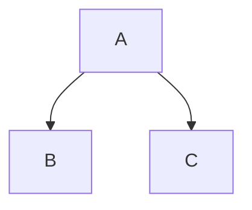
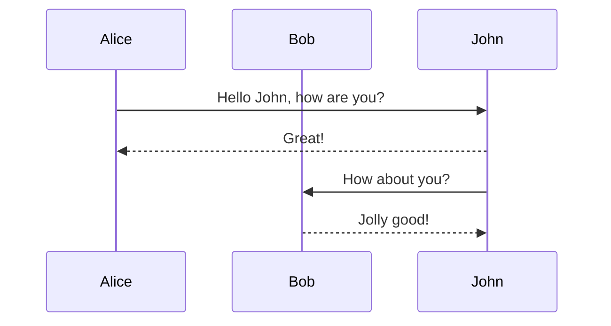
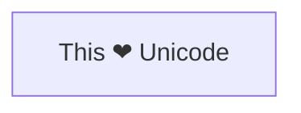

 


```mermaid
flowchart TD
  A[The Excalidraw Plugin is Community Supported] --> B{Will YOU support it?}
  B -- 👍 Yes --> C[Long-term stability + new features]
  B -- No 👎 --> D[Plugin eventually stops working 😢]
  C --> E[Support at ❤️ https://ko-fi.com/zsolt]
  E --> F[📢 Encourage others to support]
  D --> G[🪦 R.I.P. Tryout Plugin]
  ```


---


```mermaid
flowchart LR

id1[This is the text in the box]
```

---
  

### Diagrams

  

---
 


  



  

### Sequence Diagrams

  




---




